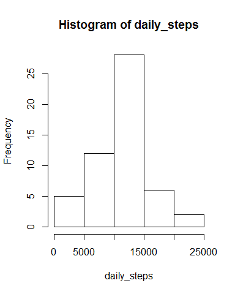
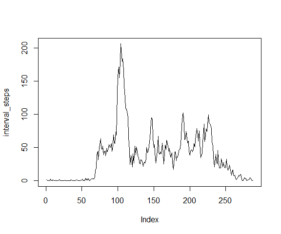
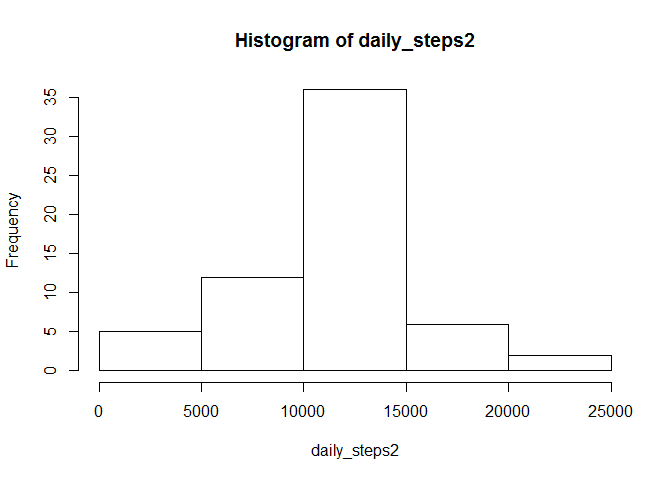
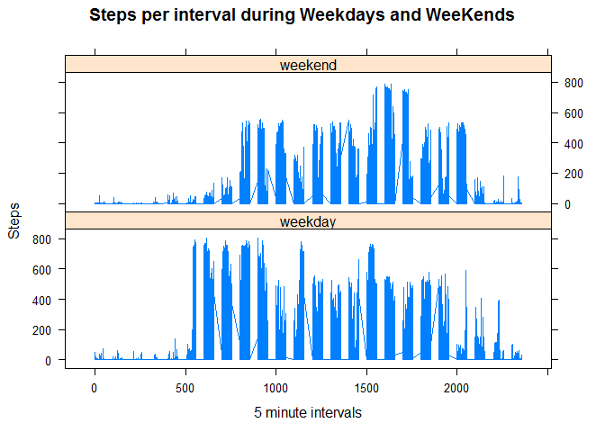
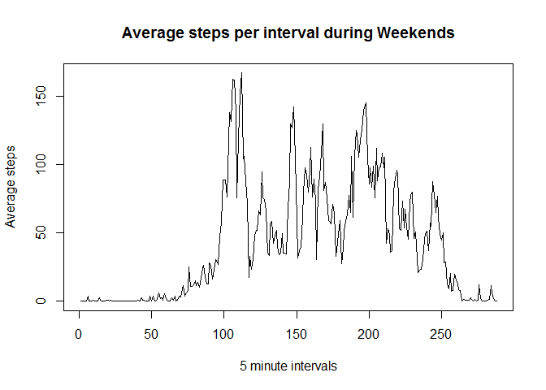
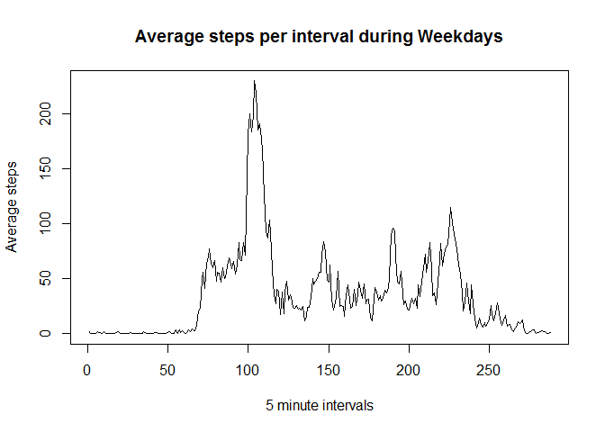

# Reproducible Research: Peer Assessment 1


## Loading and preprocessing the data

Unzip de activity.zip file that contains the dataset to be used

```r
unzip("activity.zip")
```

Loads the data in a dataframe called data01

```r
data01 = read.csv("activity.csv")
```


## What is mean total number of steps taken per day?

Calculate total steps per day

```r
daily_steps=tapply(data01$steps, data01$date, sum) 
```

Histogram of the total number of steps taken each day

```r
hist(daily_steps)
```

 

Calculate the mean of the total number of steps taken per day

```r
mean(daily_steps, na.rm=TRUE)
```

```
## [1] 10766.19
```

Calculate the median of the total number of steps taken per day

```r
median(daily_steps, na.rm=TRUE)
```

```
## [1] 10765
```

Verify the values of Mean and Median provided by the summary function

```r
summary(daily_steps)
```

```
##    Min. 1st Qu.  Median    Mean 3rd Qu.    Max.    NA's 
##      41    8841   10760   10770   13290   21190       8
```


## What is the average daily activity pattern?
Calculate average steps per interval

```r
interval_steps=tapply(data01$steps, data01$interval, mean, na.rm=TRUE) 
```

Plot time series of the 5 minute intervaland 

```r
plot(interval_steps, type="l") 
```

 

Identify the interval with the maximum number of steps

```r
interval0=as.numeric(names(which.max(interval_steps)))
```

Identify the hour and minutes of the beginning of the interval

```r
hour0<-round(interval0/100)
minutes0<-interval0-(hour0*100)
```

Identify the hour and minutes of the end of the interval

```r
interval1=interval0+5
hour1<-round(interval1/100)
minutes1<-interval1-(hour1*100)
```

#### _The interval with more steps as an average is the interval between 8:35 and 8:40_


## Imputing missing values
Count amount of missing values

```r
completeRows=complete.cases(data01)
sum(!completeRows)
```

```
## [1] 2304
```

Create a data frame that has the average values for each 5 minutes interval

```r
interval_steps=tapply(data01$steps, data01$interval, mean, na.rm=TRUE) 
interval_data=data.frame(interval_steps)
interval_data=cbind(Interval_Names= as.integer(rownames(interval_data)), interval_data)
interval_data$interval_steps<-as.numeric(interval_data$interval_steps)
```


Create a new data set as a merge between the original data set and the data set with the average values for each 5 minute interval

```r
data02=merge(data01, interval_data, by.x = "interval", by.y="Interval_Names")
```


Replace the NAs with the average 

```r
data02$steps[is.na(data02$steps)]<-data02$interval_steps[is.na(data02$steps)]
data02$interval_steps<-NULL
```


## Are there differences in activity patterns between weekdays and weekends?

Calculate total steps per day

```r
daily_steps2=tapply(data02$steps, data02$date, sum) 
```

histogram of the total number of steps taken each day

```r
hist(daily_steps2)
```

 

Calculate the mean of the total number of steps taken per day

```r
mean(daily_steps2, na.rm=TRUE)
```

```
## [1] 10766.19
```

Calculate the median of the total number of steps taken per day

```r
median(daily_steps2, na.rm=TRUE)
```

```
## [1] 10766.19
```

Verify the values of Mean and Median provided by the summary function

```r
summary(daily_steps2)
```

```
##    Min. 1st Qu.  Median    Mean 3rd Qu.    Max. 
##      41    9819   10770   10770   12810   21190
```

##### Plot a time series plot of the 5 minute interval for weekends and weekdays and the average steps taken on each interval

Copy the dataset of the previous step and create a factor variable to signal weekdays and weekends

```r
data03<-data02
dim(data03)[1]
```

```
## [1] 17568
```

```r
for (i in 1:dim(data03)[1]) {
  if ((weekdays(as.POSIXct(data03$date[i]))=="sábado") || (weekdays(as.POSIXct(data03$date[i]))=="domingo"))
      data03$datetype[i]<-"weekend"
    else
      data03$datetype[i]<-"weekday"
  }
```

Plotting the combined Panel Plot 

```r
library(lattice)
xyplot(data03$steps ~ data03$interval  | data03$datetype, 
      layout=c(1,2), type="l", main="Steps per interval during Weekdays and WeeKends",
      ylab="Steps", xlab="5 minute intervals")
```

 

Plotting a separate plot for weekends (not asked in the assignment)

```r
subwe=subset(data03, datetype == "weekend")
subwe_steps=tapply(subwe$steps, subwe$interval, mean, na.rm=TRUE) 
plot(subwe_steps, type="l", main="Average steps per interval during Weekends", ylab="Average steps", xlab="5 minute intervals")
```

 

Plotting a separate plot for weekdays (not asked in the assignment)

```r
subWD=subset(data03, datetype == "weekday")
subWD_steps=tapply(subWD$steps, subWD$interval, mean, na.rm=TRUE) 
plot(subWD_steps, type="l", main="Average steps per interval during Weekdays", ylab="Average steps", xlab="5 minute intervals")
```

 


#The end
